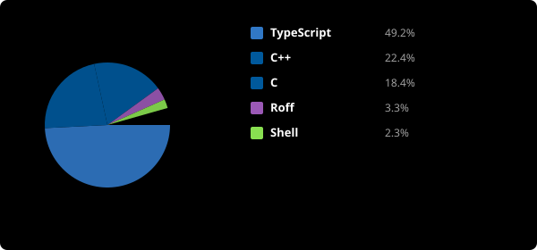

  

  

---

### 👋 About Me

   
  

I am a **Backend Developer** student at **École 42 Paris**, specializing in **C/C++** and **NestJS** API development. I am deeply interested in **cybersecurity** and infrastructure orchestration. I focus on building scalable, secure, and efficient server-side applications.

💼 **Looking for:** A **4-6 month internship** or a **1-year apprenticeship** starting in **September 2026**.

---

### 📩 Contact

  
  

---

### 🛠️ Languages

  
  
  
  
  
  

---

### 🧠 Skills

  
  
  
  
  
  
  
  
  
  

---

### 🚀 Projects

  
  
  
  
  
  
  
  
  

---

### 📊 Performance

  

  

<!-- 

  

 -->